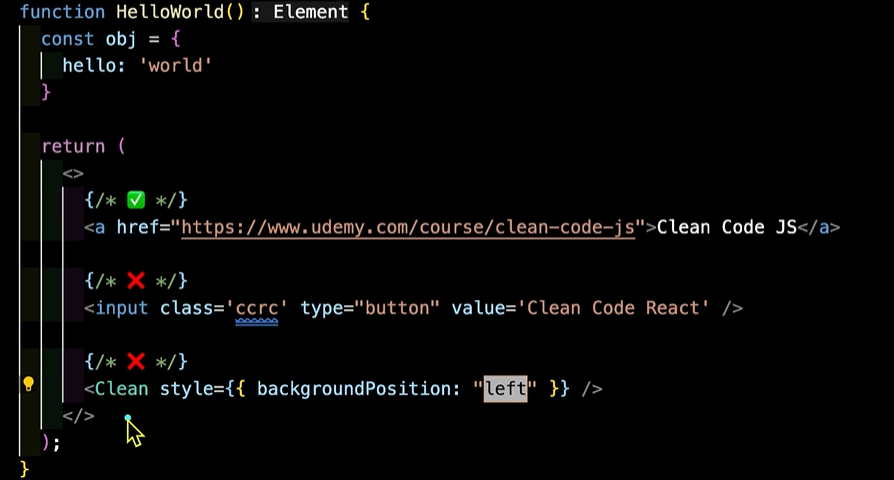

### week3

# 17. 불필요한 Props 복사 및 연산 
``` jsx
function CopyProps({value}):Element{
    const [copyValue] = useState(값_비싸고_무거운_연산());
    return <div>{value}</div>
}
//useState 사용 ❌
```
상태 업데이트가 필요 없는데도 불필요한 상태를 생성하고 있으며, 렌더링이 발생할 때마다 이 무거운 연산이 다시 수행됨

``` jsx
function CopyProps({value}):Element{
    const [copyValue] = 값_비싸고_무거운_연산()
    return <div>{value}</div>
}
//컴포넌트 내부의 변수에 값 저장 ❌
```
컴포넌트 내부의 변수에 값을 저장하는 것은 , 렌더링 시 매번 연산을 수행하게 됨


``` jsx
function CopyProps({value}):Element{
    const copyValue = useMemo(() :any => 값_비싸고_무거운_연산(value),[value]);
    return <div>{value}</div>
}
```
useMemo를 사용하면
무거운 연산의 결과를 copyValue 변수에 저장하고 있는데 이때 의존성 배열인 value가 변경될 때마다 연산을 다시 해서 새로운 값을 계산하고, 그 값을 copyValue에 저장하게 된다!

=> 매번 렌더링될 때마다 불필요하게 함수를 호출하는 것을 방지

#### 추천 : 컴포넌트에 props로 내려오기 전에 이런 무거운 연산들이 끝나는것을 추천

#### 비추천 : props를 복사하는 행위 -> 데이터의 흐름을 끊는 것


# 18. Curly Braces (중괄호)


JSX에서 속성은 따옴표 안에 넣었을 때 문자열로 들어간다

=> 문자열 이면 curly braces를 생략 가능 

curly braces 사용
- 논리적인 변수나 숫자,
- boolean, 객체에 해당되는 배열
- 함수, 표현식

``` jsx
{"clean-code"} 
"clean-code"
```


# 19. Shorthand Props (Props 축약하기 )


``` jsx
funtion ShorthandProps(props):Element {
    return(
        <header
            isDarkMode={true}
            isLogin={true}
            hasPadding={true}
            isFixed={true}
            isAdmin={true}
            >
                <ChildComponent {...props} />
        </header>
    );
}
```
주로 다크모드, 로그인 같이 토글링 되는 값은 true인게 보장되지 않는다.

```
hasPadding={true}
isFixed={true}
isAdmin={true}
```
props의 특징으로 
- 항상 Boolean이고
- 항상 true이면 

#### -> value를 생략가능 


``` jsx
funtion ShorthandProps({isDarkMode, isLogin}):Element {
    return(
        <header
            isDarkMode={isDarkMode}
            isLogin={isLogin}
            hasPadding
            isFixed
            isAdmin
            >
                <ChildComponent {...props} />
        </header>
    );
}
```
Boolean을 넘기는 값들은 value를 생략해서 축약할 수 있다!

# 20. Single Quoto vs Double Quotes (' ' vs " ")


1. 첫 번째로 팀에서의 일반적인 규칙 -> 일관성을 지키기 위함
2. HTML? JavaScript? 에서의 차이를 두는지
3. 결론적으로 규칙을 정하고 그 맥락을 파악하고 공유하자 -> Lint, 포맷팅 도구에 위임하자



- 1 : 기본적으로 html은 Double Quotes를 많이 사용한다. -> o

- 2 : 하나의 HTML 태그에 Quotes를 혼용해서 썼기 때문에 일관성 x

- 3 : 위에 있는 자바스크립트는 Single Quotes를 썼는데 아래 자바스크립트 표현식은  Double Quotes를 썼다. -> x


# 21. 알아두면 좋은 Props 네이밍
``` jsx
    <ChildComponent
        className="mt-0"
        clean="code"
        cleanCode="react"
        OtherComponent={OtherComponent}
        //컴포넌트를 넘기고 있음을 직관적으로 알 수 있도록 통일시켜서 네이밍
        isShow //무조건 true인 경우 생략해서 축약
    />
```
리액트에서 컴포넌트는 pascal case(첫 글자 대문자)로 시작한다.

### 워드가 이어지는 형태로 네이밍하자

일반적으로 자바스크립트 object 객체의 key와 value들을 다룰 때
이런 언더바 형태나 kebab 형태는 좋지 못하다.


# 22. 인라인 스타일 주의하기 

``` jsx
function InlineStyle() :Element{
    return 
    <button style={"backgroundColor:'red'; fontSize:'14px';"}> 
    clean code 
    </button>;
}
```


``` jsx
function InlineStyle() :Element{
    const myStyle = {backgroundColor:'red', fontSize:'14px'};

    return <button style={myStyle}> clean code </button>;
}
```
- key는 주로 camelCase(첫 글자 소문자)를 쓴다
- 중괄호 안에 객체를 넣어서 사용할 수 있다

수정되지 않는 css이기 떄문에 컴포넌트 밖으로 빼는것도 가능하다.

컴포넌트 내부에 집어넣으면 렌더링 될때마다 불필요하게 작동한다

``` jsx
// 스타일 객체를 컴포넌트 외부에 정의
const myStyle = { backgroundColor: 'red', fontSize: '14px' };

function InlineStyle() :Element {
    return <button style={myStyle}>clean code</button>;
}

```

### 중괄호 안에 객체 형식 + camelCase를 사용하자 