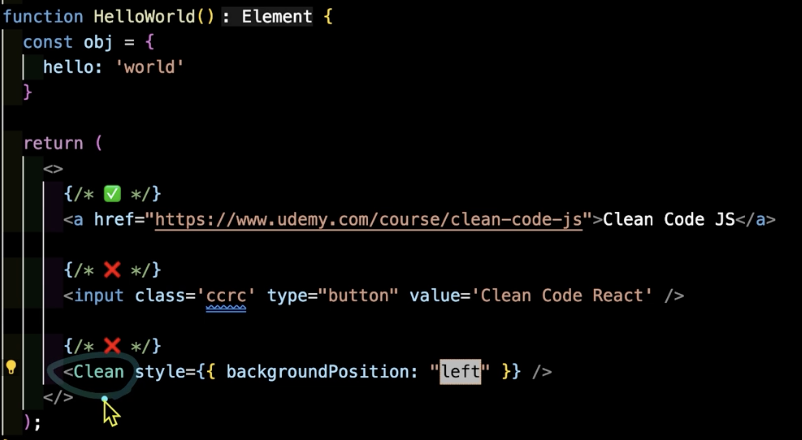
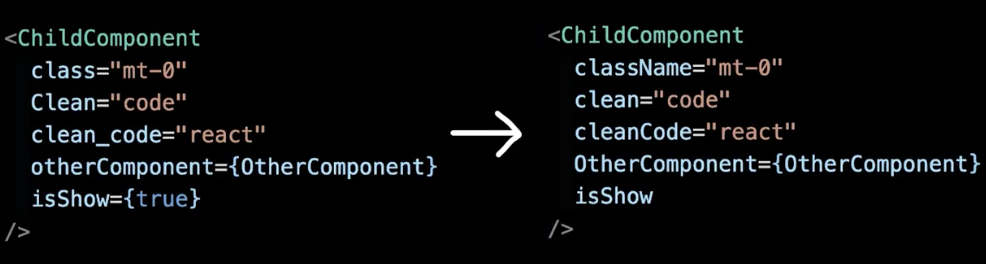

*** 불필요한 Props 복사 및 연산
```javascript
function component({value}) {
    const [copyValue] = useState(무거운_연산(value)) 
    // 이거 없이 그냥 value 사용해도 되는데 구우ㅜㅇ욷이 사용할 떄가 있음

    return <div>{copyValue}</div>
}

👇
function component({value}) {
    const [copyValue] = useMemo(()=>무거운_연산(value),[value])

    return <div>{copyValue}</div>
}
```
렌더링 될 때마다 연산이 계에에속 수행됨

useMemo란? 리액트에서 컴포넌트의 성능을 최적화 하는데 사용되는 훅
컴퓨터 프로그램이 동일한 계싼을 반복해야 할 때, 이전에 계산한 값을 메모리에 저장함으로써 동일한 계산의 반복 수행을 제거하여 프로그램 실행 속도를 빠르게 하는 기술이다. 

리액트에서 함수형 컴포넌트는 렌더링 -> 컴포넌트 함수 호출 -> 모든 내부 변수 초기화의 순서를 거친다.

불필요한 연순 줄이는 법
1. props 바로 사용하기
2. 연산된 값을 props로 넘기기
3. useMemo로 연산 최적화하기

***
### 중괄호(Curly Braces) 사용하기

문자열일 땐 중괄호 생략해도 됨

but, 계산되어서 들어가는 값은 객체는 중괄호를 쓰는게 좋음

*** 
### Props 축약하기
```javascript
function component(props) {
    <HeaderComponent hasPadding = {props.hasPadding}>
        <ChildCoponent isDarkMode = {props.isDarkMode} isLogin = {props.isLogin}/>
    </HeaderComponent>
}
👇
function component({ hasPadding,...props}) {
    <HeaderComponent hasPadding = {props.hasPadding}>
        <ChildCoponent {...props}/>
    </HeaderComponent>
}
```

상위 컴포넌트에서 받아내는 props를 하위 컴포넌트로 내보낼 때 하나하나 넣는게 아니라 spread operator(...)로 넘기자!

***
### Single Quotes('') vs Double Quotes("")
의미 없는 논쟁이기도 함 ~~진짜 의미 없어 보임~~

팀에서 일반적인 규칙 => 일관성을 지키기 위해 정해보자


뭘 쓰든 상관 없으나 일관성을 지켜서 사용하자

prettier나 ESLint 설정만 잘 해주면 알아서 바꿔주긴 함

***
### 알아두면 좋은 Props 네이밍



지양해야할 것
1. 소문자로 쓰자
2. 언더바도 쓰지 말자 + - 이것도
3. 단어로 이어지는 변수를 쓰자

camel case => myName
sname case => my_name

***
### 인라인 스타일 주의하기
```javascript
function InlineStyle():Element {
    return (
        <button style = "background-color: 'red'; font-size: '14px';">
            Clean Code
        </button>
    )
👇
function InlineStyle():Element {
    const myStyle = {background:'red', fontSie:'14px'}
    return (
        <button style ={myStyle}>
            Clean Code
        </button>
    )
}
```
jsx는 자바스크립트로 html을 표현하는 문법이라고 볼 수 있다.

**결론: JSX에서 인라인 스타일을 쓰려면 중과호 안에 camelCase key를 가진 객체를 넣어야 한다.**