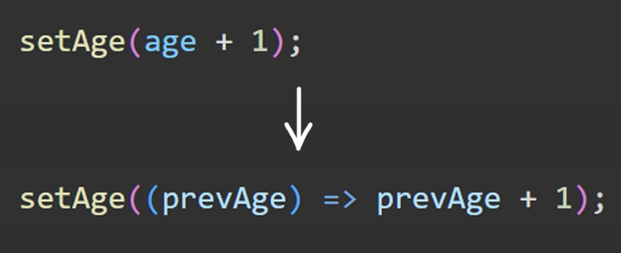

본격적으로 들어가기 전에 \
Vite를 사용해서 빌드를 해줄것이다.

<pre>
<code>npm create vite@latest my-app -- --template react</code>
</pre>

 * * *

### **상태 소개**

#### 상태가 무엇일까요?
* 컴포넌트 상태
* 전역 상태
* 서버 상태
* 상태 변경
* 상태 최적화
* 렌더링 최적화
* 불변성
* 상태 관리자

<br/>등등 이런것을 상태라고 부릅니다

### 상태관리의 필요성? 
같이 고민해봅시다

***

### **올바른 초기값 설정**

초기값? 
가장 먼저 렌더링될 때 순간적으로 보여질 값

*리액트 렌더링은 여러번 발생되고 그 속도, 순서를 제어할 수 없는 경우가 많기 때문에 초기값 설정이 중요하다!*


초기값 제대로 설정하지 않을 시
* 렌더링 이슈
* 무한 루프
* 런타임 에러

등등이 발생할 수 있음


예시
```javascript
import { useEffect, useState } from 'react'


function App() {
  const [count, setCount] = useState(0) // 초기 설정을 숫자로!
  const [list, setList] = useState([])
  // 아무것도 안 쓰는 경우 밑에서 배열인지 아닌지 검사하는 경우가 또 필요함 
  const [loading, setLoading] = useState(false)

  useEffect(() => {
    const fetchData = async () => {
      setLoading(true)
      const response = await fetch("https://api.example.com/data")
      const result = await response.json()
      setList(result)
    }
    fetchData()
  }, [])
  return (
    <>
      <button onClick={() => { setCount(prev => prev + 1) }}>
        {count}
      </button>
      <div>
        {list.map((item) =>
          <div>
            {item}
          </div>
        )}
      </div>
    </>
  )
}

export default App

```


***
### 업데이트 되지 않는 값

아래와 같이 변수가 컴포넌트 안에 있는 경우
```javascript
function NotUpdateValue() {
  const INFO = {
    name : "My Component",
    value : "Clean Code React"
  }

  return (
    <div>
        <div>{INFO}</div>
        <Show info = {INFO}/>
    </div>
  )
}
```

일단 리액트 컴포넌트 내부에 있기 때문에

매번 렌더링 될 때마다 같은 값이더라도 또 다시 참조해서 트리거하고

계산해야 될 시기와 기억해야 될 시기에 대한 로직이 전혀 들어가 있지가 않음

=>  불필요하게 참조하고 있음

따라서!! 이런경우 그냥 컴포넌트 밖으로 빼줌

```javascript
const INFO = {
    name : "My Component",
    value : "Clean Code React"
  }

function NotUpdateValue() {
  return (
    <div>
        <div>{INFO}</div>
        <Show info = {INFO}/>
    </div>
  )
}
```

**결론 : 업데이트 되지 않는 상수나 고유한 값들은 컴포넌트 외부에 관리하자**

***
### 플래그 상태

`플래그 값 : 프로그래밍 언어에서 전통적으로 특정 조건을 갖고 있거나 어떠한 흐름을 제어하기 위한 조건을 불리언으로 나타내는 값`

플래그를 만들 때 useState를 사용하지 말고 컴포넌트 내부의 변수로 활용을 해보자
```
const isLogin = hasToken && hasCookie && isValidCookie && isNewUser == false && isValidToken && 추가 조건 등등
```


*** 

### 불필요한 상태 제거하기

``` javascript
const [userList, setUserList] = useState(MOCK_DATA); // 초기 상태 선언
const [complUserList, setComplUserList] = useState(MOCK_DATA); // 변경 후 저장할 상태 선언

useEffect(():void => {
    const newList = complUserList.filter((user):boolean => user.completed === true);

    setUserList(newList);
},[userList])
```

위와 같이 하면 큰 낭비임!!

```javascript
const complUserList = complUserList.filter((user):boolean => user.completed === true)
```
그냥 내부의 변수로 사용하면 편함

즉 렌더링 마다 고유의 값을 가지는 변수로 만들면 편합니다


요약
1. props를 useState에 넣지 않고 바로 return 문에 사용하기
2. 컴포넌트 내부 변수는 렌더링마다 고유한 값을 가짐
3. 따라서 useState가 아닌 const로 상태를 선언하는 게 좋은 경우도 있음


***
### useState 대신 useRef


리렌더링 방지가 필요하다면 useState 대신 useRef!

컴포넌트의 전체적인 수명과 동일하게 지속된 정보를 일관적으로 제공해야하는 경우 ex) isMount같은 경우


***
### 연관된 상태 단순화하기


복잡할수록 단순하게 => KISS(Keep It Simple Stupid)

위 사진의 경우(원래 코드에선 error까지 있음) 세 변수가 서로 연관되어 있으므로 따로 useState를 통해 관리해 주는 것이 잠재적인 문제가 있음

따라서, 열거형 데이터로 바꿔보자!(객체로 바꿔도 되긴 함)

**결론 : 리액트의 상태를 만들 때 연관된 것들끼리 묶어서 처리하면 에러를 방지하고 코드가 간결해진다** 

***
### 연관된 상태 객체로 묶어내기


이전 로직을 객체로 바꿔준 거임

***
### useState에서 useReducer로 리팩터링 하기

~~ㅜㅜuseReducer 잘 모르는 개념,,,~~


연관된 상태를 구조화한다는 관점에서 봅시다

```javascript

const reducer = (state, action) => {
  switch(action.type) {
    case "VALUE1": // 여기서 타입을 내가 명시해야함
      return {...state, VALUE1 : true}

    case "VALUE2":
      return {...state, VALUE2 : true}

    case "VALUE3":
      return {...state, VALUE3: true}

    default:
      return INIT_STATE
  }
}
...
const [state, dispatch] = useReducer(reducer, INIT_STATE)
// useRecuer도 get, set할 수 있음
// 내부에선 조작하는 함수와 초기값을 넣어주어야 함

dispatch({tyle:"VALUE1"}) // 이런식으로 사용해주면 됨
```

**결론 : 여러 상태가 연관됐을 때 useState 대신 useReducer를 사용하면 상태를 구조화할 수 있다.** 

***
### 상태 로직 Custom Hooks로 뽑아내기


말 그대로 직접 hook을 제작해서 사용하는 것!!

추상화, 추상화, 추상화

***
### 이전 상태 활용하기


~~이건 넘 쉬운디~~

이전 상태 가져와서 업데이트 하는 방식으로 사용해야 합니다
특히 input을 핸들링하는 경우!! 불필요한 에러를 방지할 수 있슴


섹션 2 끝~