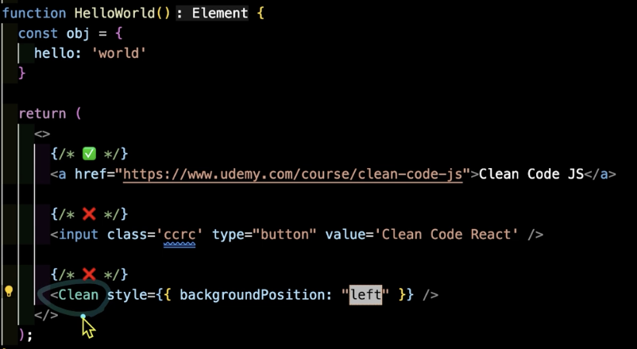
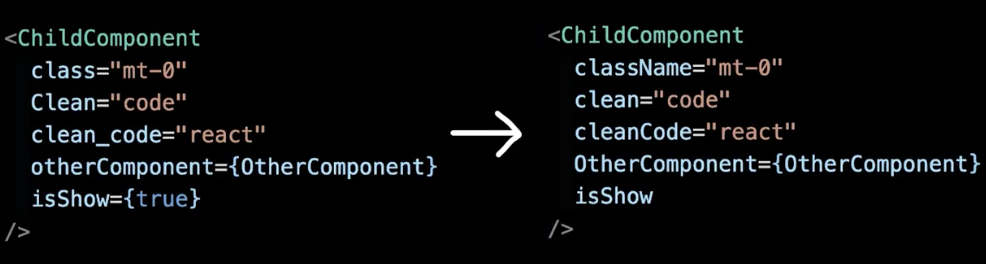

### 불필요한 Props 복사 및 연산
```javascript
function component({value}) {
    const [copyValue] = useState(무거운_연산(value)) 
    // 이거 없이 그냥 value 사용해도 되는데 구우ㅜㅇ욷이 사용할 떄가 있음

    return <div>{copyValue}</div>
}

👇
function component({value}) {
    const [copyValue] = useMemo(()=>무거운_연산(value),[value])

    return <div>{copyValue}</div>
}
```
렌더링 될 때마다 연산이 계에에속 수행됨

useMemo란? 리액트에서 컴포넌트의 성능을 최적화 하는데 사용되는 훅
컴퓨터 프로그램이 동일한 계싼을 반복해야 할 때, 이전에 계산한 값을 메모리에 저장함으로써 동일한 계산의 반복 수행을 제거하여 프로그램 실행 속도를 빠르게 하는 기술이다. 

리액트에서 함수형 컴포넌트는 렌더링 -> 컴포넌트 함수 호출 -> 모든 내부 변수 초기화의 순서를 거친다.

불필요한 연순 줄이는 법
1. props 바로 사용하기
2. 연산된 값을 props로 넘기기
3. useMemo로 연산 최적화하기

***
### 중괄호(Curly Braces) 사용하기

문자열일 땐 중괄호 생략해도 됨

but, 계산되어서 들어가는 값은 객체는 중괄호를 쓰는게 좋음

*** 
### Props 축약하기
```javascript
function component(props) {
    <HeaderComponent hasPadding = {props.hasPadding}>
        <ChildCoponent isDarkMode = {props.isDarkMode} isLogin = {props.isLogin}/>
    </HeaderComponent>
}
👇
function component({ hasPadding,...props}) {
    <HeaderComponent hasPadding = {props.hasPadding}>
        <ChildCoponent {...props}/>
    </HeaderComponent>
}
```

상위 컴포넌트에서 받아내는 props를 하위 컴포넌트로 내보낼 때 하나하나 넣는게 아니라 spread operator(...)로 넘기자!

***
### Single Quotes('') vs Double Quotes("")
의미 없는 논쟁이기도 함 ~~진짜 의미 없어 보임~~

팀에서 일반적인 규칙 => 일관성을 지키기 위해 정해보자


뭘 쓰든 상관 없으나 일관성을 지켜서 사용하자

prettier나 ESLint 설정만 잘 해주면 알아서 바꿔주긴 함

***
### 알아두면 좋은 Props 네이밍



지양해야할 것
1. 소문자로 쓰자
2. 언더바도 쓰지 말자 + - 이것도
3. 단어로 이어지는 변수를 쓰자

camel case => myName

sname case => my_name

***
### 인라인 스타일 주의하기
```javascript
function InlineStyle():Element {
    return (
        <button style = "background-color: 'red'; font-size: '14px';">
            Clean Code
        </button>
    )
👇
function InlineStyle():Element {
    const myStyle = {background:'red', fontSie:'14px'}
    return (
        <button style ={myStyle}>
            Clean Code
        </button>
    )
}
```
jsx는 자바스크립트로 html을 표현하는 문법이라고 볼 수 있다.

**결론: JSX에서 인라인 스타일을 쓰려면 중과호 안에 camelCase key를 가진 객체를 넣어야 한다.**

*** 
### CSS IN JS 인라인 스타일 지양하기

```javascript
return (
    <div css = {css`속성 어쩌구 저쩌구`}> ㅎㅇ~ </div>
)

⬇️
return (
    <div css = {cardCss.self}> ㅎㅇ~ </div>
)
```

분리했을 때 장점
1. 외부로 분리했기 때문에 스타일이 렌더링 될 때마다 직렬화 되지 않는다 => 한번만 렌더링 됨
2. 동적인 스타일을 실수로 건드는 확률이 적어진다.
3. 스타일 관련 코드를 분리해서 로직에 집중하고 JSX를 볼 때 조금 더 간결하게 볼 수 있다.
4. 타입 안전성, 자동 완성으로 생선성 DX
5. export 하여 재사용 가능(확장)


***
### 객체 Props 지양하기

```javascript
Object.is(
    {hello:"world"}, // 초기 렌더링
    {hello:"world"} // 두번째 렌더링
) ===> 출력값 :false

Object.is(
    ["hello"], // 초기 렌더링
    ["hello"] // 두번째 렌더링
)===> 출력값 : false
```
리액트의 관점에선 위의 코드의 초기렌더링과 두번째 렌더링 모두 둘다 같지 않은 걸로 판단됨

어떻게 고쳐야 할까?

- 변하지 않는 값일 경우 컴포넌트 외부로 드러내기
- 필요한 값만 객체를 분해해서 Props로 내려준다
- 정말 값 비싼 연산, 너무 잦은 연산이 있을 경우 useMemo()를 활용하여 계산된 값을 메모이제이션한다.
- 컴포넌트를 더 평탄하게 나누면 나눌 Props 또한 평탄하게 나눠서 내릴 수 있다

```javascript
funtion SomeComponent() {
    return (
        <ChildComponent  
        propObj = {{hello:"world"}} 
        propArr = {["hello", "hello"]}/>
    )
}

⬇️

funtion SomeComponent({heavyState}) {
    const [propArr, setPropArr] = useState(["hello", "hello"])
    const computedState = useMemo(()=>{
        heavyState : heavyState
    },[heavyState])
    return (
        <ChildComponent  
        hello = "world"
        propArr = {propArr.at(0)}
        computedState = {{
            heavyState: heavyState
        }}/>
    )
}
```

*** 
### HTML Attribute 주의하기
```javascript
function MyButton({childern, type}) {
    return <button type = {type}>{children}</button>
}

⬇️

function MyButton({childern, ...rest}) {
    return <button {...rest}>{children}</button>
}
```

HTML 속성 => Attribute

자바스크립트에서의 속성 => Property

**결론 : props를 선언할때 HTML의 기본 attribute와 겹치는지 꼭 확인하자!**

***
### SPREAD 연산자 쓸 때 주의할 점
```javascript
function ParentComponent(props) {
    return <ChildorHOCComponent {...props}/>
}

⬇️

function ParentComponent(props) {
    const {관련없는props, 관련있는props, ...나머지props} = props
    return <ChildorHOCComponent 
        관련있는props = {관련있는props}
        {...나머지props}
    />
}
```
*spread문법은 자바스크립트 문법입니다 (오 처음 알앗음..)*

더 밀접한 관계를 갖고 잇는 props를 명시적으로 표현한다면 유지보수하기 쉬운 코드가 나올 수 있습니다


*** 
### 많은 props 분리하기

```javascript
return (
    <JoinForm
        user = {user}
        auth = {auth}
        location = {location}
        favorite = {favorite}
        handleSubmit = {handleSubmit}
        handleReset = {handleReset}
        handleCancel = {handleCancel}
    />
)
⬇️
return (
    <JoinForm
        onSubmit = {handleSubmit}
        onReset = {handleReset}
        onCancel = {handleCancel}
    >
        <CheckBoxFOrm formData = {user}/>
        <CheckBoxFOrm formData = {auth}/>    
        <RadioButtonForm formData = {location}/>
        <SectionForm formData={favorite}>
    </JoinForm>
)
```

props가 많을 때 분리하는 법!
1. One Depth 분리를 한다
2. 확장성을 위한 분리를 위해 도메인 로직을 다른 곳으로 모아넣는다(재활용성)


*** 
### 단순하게 props 내리기
```javascript
const UserInfo ({user}) => {
    return (
        <div>  
            
            <h3>{user.userName}</h3>
            <h4>{user.email}</h4>
        </div>
    )
}

⬇️

const UserInfo ({imgUrl, userName, email}) => {
    return (
        <div>  
            
            <h3>{userName}</h3>
            <h4>{email}</h4>
        </div>
    )
}
```

**객체를 통으로 props로 넘기기보단 단순하게 props를 줄여봅시다**
