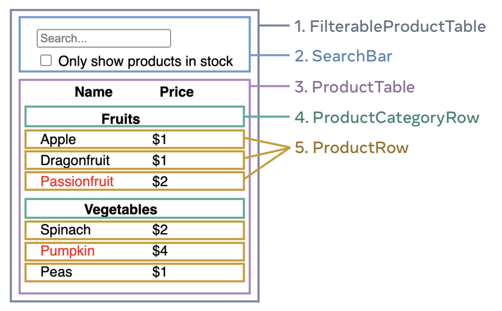

# 컴포넌트 소개

컴포넌트란? 스스로 상태를 관리하는 캡슐화된 컴포넌트 by 옛날 리액트 문서


### 기존에는 웹페이지를 만들 때 웹 개발자가 컨텐츠를 마크업한 다음 JavaScript를 뿌려 상호작용을 추가했다
이는 웹에서 상호작용이 중요했던 시절에 효과적이었음


이제는 많은 사이트와 모든 앱에서 상호작용을 기대합니다
React는 동일한 기술을 사용하면서도 상호작용을 우선시 한다

### React 컴포넌트는 마크업으로 뿌릴 수 있는 Javascript 함수이다


상태관리가 필요한가요?

예전에는 사이트에서 많은 인터랙션이 필요 없었음

but! 요즘에는 데스크탑, 태블릿 모바일 까지 다양한 플랫폼을 지원해야함 => 따라서 수많은 인터랙션이 따름



Thinking in React(https://react.dev/learn/thinking-in-react)라는 사이트에 가면 리액트에서 컴포넌트를 어떻게 나누고 상태를 어떻게 만드는지 설명되어 있음 읽어보는 것을 추천합니닷


***

# Self-Closing Tags

```javascript
</Img>  
    👇
   
```

MDN 문서에 void element라는 칸을 보면 하위노드들을 가지지 않는 태그들의 목록이 있음
=> 이런 태그들은 열고 닫을 필요가 없음

기본 HTML 요소인지 아닌지 명확한 차이를 가지도록 해봅시다

## 결론 : 자식 요소를 가질 수 없는 Void Element에 대해 알고, 닫는 태그가 정말 필요한지 파악하자


&nbsp;

&nbsp;

&nbsp;
# Fragment 지향하기

```javascript
function Component(){
    return(
        <div>
            <ChildA/>
            <ChildB>
        </div>
    )
}
```
👇
```javascript
function Component(){
    return(
        <React.Fragment>
            <ChildA/>
            <ChildB>
        </React.Fragment>
        (대신 <></> 이것도 가능)
    )
}
```

Fragment를 사용하면 Dom에 별도의 노드를 추가히지 않고 여러 자식을 그룹화할 수 있다

Fragment 사용 이유

1. Fragment 사용 대신 div를 사용했을 때 스타일이 깨질 수 있음
2. 코드 한줄이 줄어듦

Fragment는 16버전부터 사용이 가능하므로 버전 확인을 잘 해봅시닷

key를 반인딩해야 하는 경우는 아래와 같이 사용가능하고 숏컷은 사용 불가능!
```javascript
<React.Fragment key = {id}>
```

***
&nbsp;

&nbsp;

&nbsp;
# Fragment 지양하기

~~아깐 지향하라더니 이젠 지양이네?~~

나쁜 경우
```javascript
function Component(){
    return(
        <>
            <div>
                <ChildA/>
                <ChildB>
            </div>
        </>
    )
}
```
```javascript
return <>hello world</>
```
```javascript
return <h1>{isLoggedIn ? "User" : <></>} </h1>
```


좋은 경우
```javascript
function Component(){
    return(
        <>
            <ChildA/>
            <ChildB>
        </>
    )
}
```
```javascript
return "hello world"
```
```javascript
return isLoggedIn && <h1>User</h1>
```

불필요하게 사용된 Fragment가 없는지 잘 확인하자!!
&nbsp;

&nbsp;

&nbsp;
# 알아두면 좋은 컴포넌트 네이밍

1. PascalCase

    **단어의 시작을 대문자로 표기하는 방식**
    
    ex) Component, MyClass

    - 가장 일반적으로 사용됨
    - 기본 HTML요소는 lower case

2. Kebab case

    **모두 소문자로 표현하며 단어와 단어 사이에 하이픈**
    
    ex)user-login-log

    - next.js에서 라우팅 기반의 file name에서 사용

컴포넌트 네이밍 자체는 파스칼케이스를 씁시다!
```javascript
export function Component(){
    return
}
```

추가내용

3. Camel case
    **첫글자는 소문자로 두번째 단어부터는 대문자로**
    
    ex) myComponent

4. Snake case
    **케밥식이 하이픈(-)을 사용했다면 스네이크는 언더바(_)사용**

    ex)my_component or MY_COMPONENT   
  &nbsp;

&nbsp;

&nbsp;
# JSX 컴포넌트 함수로 반환

```javascript
export function Component(){
    const TopRender = () => {
        return <div>Hi</div>
    }
    return (
        <div>
            {TopRender()}
        </div>
    )
}
```
위와 같은 경우 문제가 생길 수 있슴

1. scope가 꼬일 수 있음
2. 해당 함수가 여러 방면에서 쓰일 수 있기 때문에 함수형 컴포넌트 내에서만 쓰이는 건 불필요한 일
3. props 넘기기 까다로움 

```<TopRender/>``` 이런식으로 씁시다


&nbsp;

&nbsp;

# 컴포넌트 내부에 컴포넌트 선언


컴포넌트 내부에 또 컴포넌트를 사용하는 거은 정말 안 좋은 방식!!

단점
1. 결합도 증가
    - 구조적으로, scope 적으로 종속된 개발이 됨
    - 확장성이 생겨서 분리할때 분리하기 힘듬
2. 성능 저하
    - 상위 컴포넌트 리렌더 => 하위 컴포넌트 재생성 => 많은 손해!!

외부에 또 설정하자

&nbsp;

&nbsp;

# displayName 속성 사용하기

**displayName이란?**

displayName 문자열은 디버깅 메시지 표시에 사용됩니다. 대부분의 경우 이 값을 설정하지 않아도 되는데, 왜냐하면 해당 컴포넌트를 정의하는 함수 또는 class의 이름으로부터 추론되기 때문입니다. 디버깅을 위하여 다른 이름을 표시하거나 고차 컴포넌트 생성을 위하여 명시적으로 이 값을 설정하고 싶다면, 쉬운 디버깅을 위한 Display Name 래핑하기를 통하여 자세한 정보를 확인하세요. (https://ko.legacy.reactjs.org/docs/react-component.html#displayname)

devtools를 사용하지 않는다면 잘 모를수도 있음

```javascript
var Hello = createReactClass({
    displayName: 'Hello',
    render : function() {
        return <div> Hello {this.props.name}</div>
    }
})

module.exports = Hello;
```
위와 같은 형식으로 넣을 수 있음

```javascript
const InputText = forwardRef((props, ref) : Element) => {
    return <input type = "text" ref = {ref}>
}

InputText.displayName = 'InputText';
```
사용 예시는 요렇게!

확장성이 높은 컴포넌트를 더 디버깅하기 쉽게 전달해봅시다

**결론 :devtools에서 익명 함수를 쉽게 디버깅하려면 displayName 속성을 사용하자**


&nbsp;

&nbsp;

# 컴포넌트 구성하기
1. 상수는 어디에 선언하나요?
2. 타입 선언시 interface 와 type 중 어떤 걸 사용하나요?
3. 컴포넌트 props 타입명은 어떤 규칙으로 정의하나요?
4. 컴포넌트 선언 시 const와 function 중 어떤 걸 사용하나요?
5. 어떤 순서로 컴포넌트 내부 변수를 선언하나요?
6. useEffect는 어디에 선언하나요?
7. JSX return 하는 규칙이 있나요?
8. styled component는 어디에 선언하나요?

이런거 정리해봅시다!!

### 1. 상수는 어디에 선언하나요?

- 변하지 않는 상수는 외부로
    - 객체로 묶어내거나 타입스크립트의 as const 로 readOnly 처리를 하거나 Object.freeze로 묶어내는 방법도 있음

### 타입 선언시 interface 와 type 중 어떤 걸 사용하나요?

- 이건 선호에 따라 다름
- type
    - 객체 타입 뿐 아니라 모든 타입에 대해 새로운 이름을 붙일 수 있다.
    - 새 속성을 추가하기 위해 동일한 이름으로 선언할 수 x
    ```javascript
    type TUser = {
        id:number;
        name:string;
    }

    type TUser = {
        age : number
    } # 이러면 오류 생김
    ```
- interface
    - 객체 타입을 만드는 또 다른 방법
    - 새 속성 추가할 때 동일한 이름 선언 가능
    ```javascript
    interface TUser = {
        id:number;
        name:string;
    }
    interface TUser = {
        age : number
    }

    const user1:IUser = {
        id:0,
        name :조주희,
        age: 20
    }
    ```


### 3. 컴포넌트 props 타입명은 어떤 규칙으로 정의하나요?
- 보통 컴포넌트 명과 일치한 이름 + props 조합으로 사용

### 4. 컴포넌트 선언 시 const와 function 중 어떤 걸 사용하나요?

이것도 정해진 규칙은 없음! 팀끼리 정해야함


### 5. 어떤 순서로 컴포넌트 내부 변수를 선언하나요?
- 강사님은 플래그성 상태나 ref는 상담에 놓는걸 선호함
- 라이브러리 훅들도 상위에 놓는 편 
- 이후엔 customhook, useState와 같은 컴포넌트 내부 함수는 가장 하단에 놓음
- 다음엔 컴포넌트 내부 함수들!!

나도 강사님과 비슷한 순서로 코드를 작성하는 것 같다 차이점이라고 하면 난 useState 변수들을 가장 위로 몰아두는 편


### 6. useEffect는 어디에 선언하나요?
- main jsx와 가까운 게 좋다고 생각합니다 (강사님이)


### 7. JSX return 하는 규칙이 있나요?
-  return 전에 렌더링을 하나 넣어서 이 부분부터는 렌더링 되는 jsx입니다를 명시해주는 것이 좋음

### 8. styled component는 어디에 선언하나요?
- 외부?내부?파일분리?