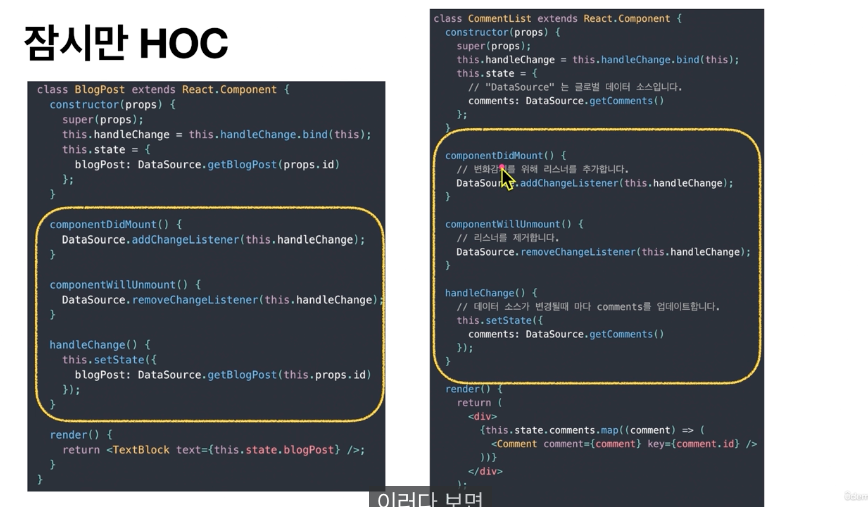

# Hooks API 소개

HOC란?

컴포넌트 로직을 재사용하기 위한 React의 고급 기술

고차 컴포넌트(HOC)는 React API의 일부가 아니며, React의 구성적 특성에서 나오는 패턴입니다

```javascript
const EnhancedComponent = highOrderComponent(WrappedComponent);
// 더 업그레이드된 컴포넌트로 반환
```
ex) connect(Redux)



위와 같이 코드가 일치하는 부분을 highOrderComponent로 뽑아내면 재활용 가능

&nbsp;

Render Props란?

React 컴포넌트 간에 코드를 공유하기 위해 함수 props를 이용하는 간단한 테크닉

구현된 컴포넌트를 자체적으로 렌더링 로직을 구현하는 대신, React 엘리먼트 요소를 반환하고 이를 호출하는 함수를 사용
```javascript
<DataProvider render = {data => (
    <h1>Hello {data.target}</hi>
)}/>
```

&nbsp;

SFC란?

클래스 컴포넌트 사용했을 때 
```javascript
class ClassComponent extends React.Component {
    render() {
        return <div>{this.props.name}</div>
    }
}
```
위와 같이 귀찮고 무거운 행위를 계속 해야하나? 고민하다가

```javascript
const StatelessComponent = props => <div>{props.name}</div>
```
이렇게 props를 받아서 순수하게 렌더링 해준 함수를 만들 수 있게 됨

Dan Abramov라는 유~명한 리액트 개발자가 있는데

"stateless 상태일 수도 있고 statefull 상태일 수도 있는데 SFC(stateless funtional components)라는 이름은 큰 혼란을 준다"

라고 말하셨답니다.

이후 클래스 컴포넌트형이 점점 선호되지 않게 됨

이렇게 Hook이 생겨났습니다~

&nbsp;

&nbsp;

***

# useEffect() 기명 함수와 함께 사용하기

기명함수(이름이 존재하는 함수)를 useEffect의 첫 번째 인자 콜백으로 넘겼을 때 장점!

=> 로직들에 집중해서 살펴보지 않아도 겉(함수명 같은거)만 봐도 알 수 있음

```javascript
useEffect(function onIncrement(){
    count++
},[])
```

에러가 터졌을 때 함수 이름으로 로그에 스택으로 쌓여서 어디에서 오류가 났는지 알 수 있음

***
# 한 가지 역할만 수행하는 useEffect

SRP(Single Responsibility Principle) : 단일 원칙 책임

=> 한번에 하나의 역할만 수행하도록 만들자!

&nbsp;

useEffect도 한번의 하나의 역할만 수행하게 해봅시다
1. 기명함수 사용
2. dependency Array에 너무 많은 관찰 대상이 들어가고 있는지 확인


```javascript
function LoginPage({token, newPath}) {
    useEffect(()=>{
        redirect(newPath);
        
        const userInfo = setLogin(token);
        // 로그인 로직

    },[token, newPath])
}

👇
function LoginPage({token, newPath}) {

    useEffect (()=>{
        redirect(newPath);
    },[newPath])

    useEffect(()=>{
        const userInfo = setLogin(token);
        // 로그인 로직

    },[token])
} // 로직이 엮여있다면 브릿지 같은 기능을 따로 만듭시다
```

**결론 : useEffect는 하나의 기능만 하게 합시다**

&nbsp;

&nbsp;
***
# Custom Hooks 반환의 종류

```javascript
const useSomeHooks = (bool) => {
    return [setState, state]
} // 보통 반대의 순서로 제공됨 따라서 [state, setState] 이렇게 만듭시다

const useSomeHooks = (bool) => {
    return state
} // 하나의 value만 있을 때는 그거 하나만 return 하도록!! 배열에 넣어서 [state] 이렇게 쓰지 않도록 주의

const useSomeHooks = (bool) => {
    return {
        first,
        second,
        third,
        rest
    }
} // 객체를 사용해서 사용하지 않고자 하는건 rest로 빠지도록 합시다 (이 경우엔 []이거에 안 담김)
```

**결론 : custom hooks 반환 타입을 변수, 배열, 객체 등으로 상황에 맞게 결정하자**

&nbsp;

&nbsp;
***

# useEffect 내부의 비동기

```javascript
useEffect(async()=>{
    const result = await fetchData()
},[]) // ❌

useEffect(() => {
    const fetchData = async() => {
        const result = await someFetch();
    }

    fetchData()
},[dependency]) // ✅
```

useEffect 내부에선 비동기 함수 사용 불가함

useEffect는 반환 타입으로 함수나 undefined와 같은 것들을 허용함

근데 async await은 promise 와 같은 것들을 Promise 객체를 반환하므로 둘이 맞지 않음

**결론 : useEffect의 콜백 함수로 비동기 함수를 바로 넣을 수 없다. 동작이 불안해지기 때문**